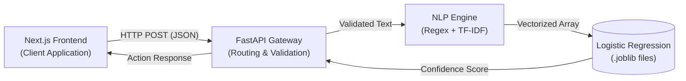

# ToxGuard: An AI-Powered Content Moderation API


* **ToxGuard** is a real-time, Natural Language Processing (NLP) powered microservice that is designed to evaluate the user-generated text for toxicity, hate speech and cyberbullying.
* It provides the digital platforms with a highly accuracte, low-latency API to automate the content moderation.

## Key Features
* **ML Engine:** Powered by a customized TF-IDF Vectorizer and Logistic Regression model that is trained on the balanced Jigsaw and Davidson public datasets.
* **High Precision:** Tuned specifically for >95% precision rate to minimize the false positives and protect the innocent users.
* **Real-Time Processing:** Stateless, in-memory execution that guarantees API response times under 500 ms (milliseconds).
* **Robust Validation:** Implements strict data validation and error handling via `Pydantic`.
* **Testing Dashboard:** Includes a sleek, dark-themed Next.js interactive dashboard for rapid API testing and demonstration

---

## System Architecture

This project utilizes a decoupled Client-Server architecture.



---

## Tech Stack
* **Backend:** Python, FastAPI, Uvicorn, Pydantic
* **Machine Learning:** Scikit-Learn, Pandas, Joblib, Regex (Regular Expressions)
* **Frontend:** Next.js, React, TailwindCSS

---

## Local Development Setup
**Prerequisites**
* Python 3.13 or higher
* Node.js v21 or higher

**1. Backend Setup (FastAPI Server)**
Clone the repository and navigate to the backend directory:
```bash
git clone https://github.com/jayencious/toxguard.git
```

Create a virtual environment and install the dependencies:
```bash
python -m venv .venv
venv/Scripts/activate
pip install -r requirements.txt
```

Start the Uvicorn ASGI Server:
```bash
uvicorn main:app --reload
```
The API can be accessed at: `http://localhost:8000`

**2. Frontend Setup (Next.js Dashboard)**
Open a new terminal window and navigate to the frontend directory:
```bash
cd toxguard/content-moderation-ui
```

Install the Node packages and run the development server:
```bash
npm install
npm run dev
```

The dashboard can accessed at: `http://localhost:3000`

---

## API Documentation

`POST /moderate`
Evaluates the text string and then returns a moderation decision.
**Request Payload:**
```JSON
{
  "text": "This is a great project!"
}
```

**Successful Response (`200 OK`):**
```JSON
{
  "original_text": "This is a great project!",
  "toxicity_confidence": 2.40,
  "action": "Allow"
}
```

**Validation Error (`422 Unprocessable Entity`):
Returned if the payload is empty or malformed.
```JSON
{
  "detail": "Text cannot be empty or null."
}
```

**Action Thresholds:**
* `Allow`: Toxicity score < 60%
* `Hide`: Toxicity score 60% - 84% (Flags for admin review)
* `Delete`: Toxicity score $\ge$ 85% (Auto-removes content)

---

## Testing
The API has been rigorously tested using Postman.

## License
This project is licensed under the MIT License - see the **LICENSE** file for details.
